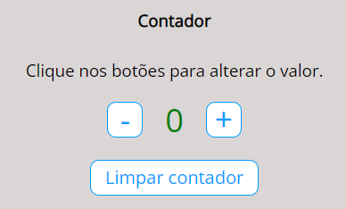

# Contador
Este projeto consiste a criação simples de um contador em JavaScript.
Para estudar Sintaxe Básica em JavaScript;

## Utilizado: 
- Manipulação da DOM com valore e estilos,
- Utilização de condicionais;
- Funções e Arroy functions;
- AddEventListener em um conteudo (click, do botão Limpar contador);

## Funcionalidade:
- Aumentar o valor;
- Diminuir o valor;
- Alterar cor do contador para verde quando valor for positivo;
- Alterar cor do contador para vermelho quando valor for negativo;
- Desabilitar botão de decrementar quando valor <= -10;
- Zerar contador quando clicado no botão Limpar contador;